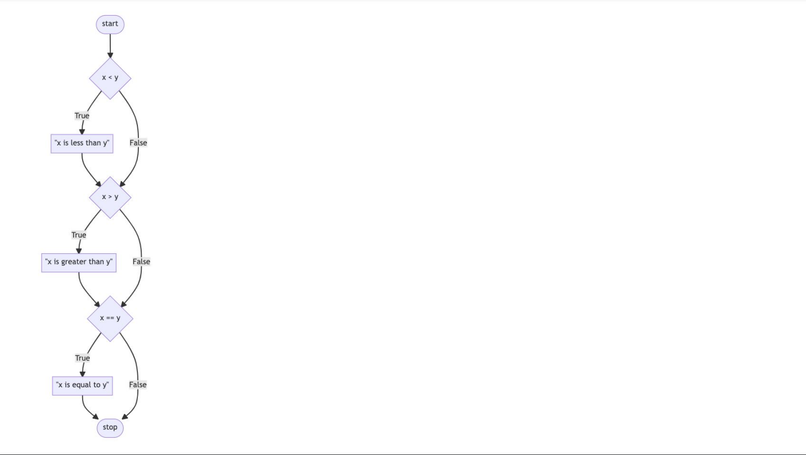
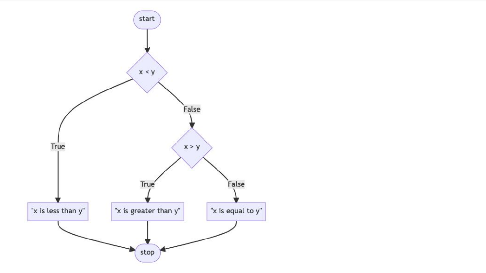

## 📝 Notes

| **Lecture** | **Topics Covered**               |         **Language**      |
|-------------|----------------------------------|---------------------------|
| `1`         | Conditionals             | Python                    |

--- 
## Lecture 1 📚

- [Conditionals in Programming](#conditionals-in-programming)

- [if Statements](#if-statements)

- [Control Flow, elif, and else](#control-flow-elif-and-else)

##  Conditionals in Programming

In every programming language, **Conditionals**  allow programmers to make **decisions** based on certain conditions.

This means a program can choose different paths or actions depending on whether certain conditions are met. Think of it like asking a series of **"What if...?"** questions, where each answer can change the outcome! 👨‍💻➡️🤔➡️✅/❌


For example, using `if`, `else if`, and `else` statements, you can make the program respond differently based on the data it receives. This is super useful for creating dynamic, responsive code! 🛤️✨


**💡 Operators in Conditionals 💡**

When setting **mathematical conditions** in code, we use **operators** to compare values.
 These symbols help the program make **decisions** based on how values relate to each other. 
 
 Here’s a quick guide to some of the most common ones:

- `>` and `<` – **Greater than** (>) and **less than** (<): Compare values to see if one is bigger or smaller 📈📉.

- `>=` – **Greater than or equal to**: Checks if the left side is **bigger or the same as** the right side ➕.

- `<=` – **Less than or equal to**: Checks if the left **side is smaller or the same as** the right side ➖.

- `==` – **Equals**: Checks if **both sides are the same**. Note the double equal sign! Double `==` is used to **compare**, while a single `=` is used to assign values 🤝.

- `!=` – **Not equal to**: Checks if **the values are** different 🚫.

Conditionals compare a **left-hand term** to a **right-hand term**. Using these operators, your program can choose different actions based on these comparisons! 🛤️✨


## if Statements
💡 **The `if` Keyword in Conditionals** 💡

In programming, `if` is a super popular keyword for writing **conditional logic**. It’s like telling the computer,  “Do this **if** a certain condition is true!”

**Here’s how it works:**

- `if` – This keyword checks a **condition**. If it’s true ✅, the code inside the **if** block runs.

- `If` the condition is **false** ❌, the code **skips** the `if` block and moves to the next part of the program.

For example:
```py
temperature = int(input("Check Temparatures"))

if(temperature > 30):
    print("It’s hot outside! ☀️")
```

**Here, the** `if` **statement** checks if the **temperature** is above 30. . If it is, the program says, “It’s hot outside! ☀️”. Otherwise, it does nothing or moves on to other conditions, like `else` or `else if`

The `if` keyword lets you **control the flow** of your program, making it **flexible** and responsive! 🌐➡️🤔➡️🎉


## Control Flow, elif, and else

💡 **Control Flow in Python** 💡

**Control flow** is the order in which a program’s code runs. It allows programs to make **decisions**, **repeat actions**, and **branch** based on conditions! 🚦

Here’s a quick breakdown:

- `if` – Checks a condition; if **true**, it runs a block of code ✅.

- `elif` – Short for "else if"; checks another condition if the first `if` was **false**. You can use multiple `elif` statements to cover **different** cases 🔄.

- `else` – Runs when none of the previous conditions are met. It’s the “default” option if everything else is **false** 🔚.

Control flow helps the program follow different paths based on data, making it dynamic and responsive! 🌐➡️🛤️➡️

**Example of control flow:**

```py
x = int(input("What's x ?"))
y = int(input("What's y ?"))

if x < y:
    print("x is less then y")
if x > y:
    print("x is greater then y")
if x == y:
    print("x is equal to y")
```


This code takes two numbers, `x` and `y`, from the user and then checks three conditions using **separate if statements:**

1. If `x` is less than `y`, it prints `"x is less than y"`.

2. If `x` is greater than `y`, it prints `"x is greater than y"`.

3. If `x` equals `y`, it prints "`x is equal to y"`.


Our code can be represented as follows:



Since each condition uses an `if` statement, all conditions are checked independently, meaning multiple messages could print if they were somehow all true.

For a cleaner structure where only one result is printed, you could use `if...elif` instead.


```py
x = int(input("What's x ?"))
y = int(input("What's y ?"))

if x < y:
    print("x is less then y")
elif x > y:
    print("x is greater then y")
elif x == y:
    print("x is equal to y")
```

Notice how the use of `elif` allows the program to make fewer decisions. 

1. If `x` is less than `y`, it prints `"x is less than y"`.

2. Elif `x` is greater than `y`, it prints `"x is greater than y"`.

3. Elif `x` equals `y`, it prints `"x is equal to y"`.

Using `if...elif...elif` ensures only one of these conditions is checked and printed, stopping as soon as the first true condition is found.


Our code can be represented as follows:


There is one final improvement we can make to our program.

```py
x = int(input("What's x? "))
y = int(input("What's y? "))

if x < y:
    print("x is less than y")
elif x > y:
    print("x is greater than y")
else:
    print("x is equal to y")
```

**Why This is Better ?**

Using `else` here is efficient because it **covers the only remaining possibility** without another condition check. 

This structure is concise and ensures only **one message** is printed based on the correct relationship between `x` and `y`.


Our code can be represented as follows:
