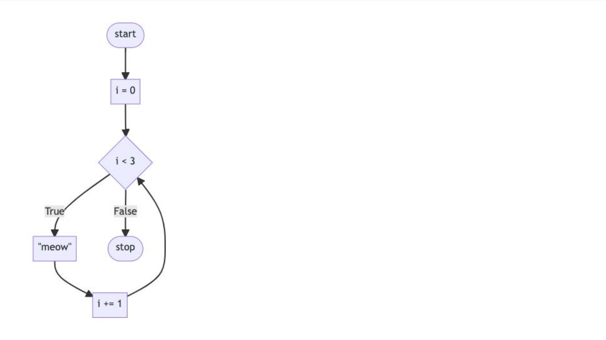

## 📝 Notes

| **Lecture** | **Topics Covered**               |         **Language**      |
|-------------|----------------------------------|---------------------------|
| `2`         | Conditionals             | Python                    |

--- 
## Lecture 2 📚

- [loops](#loops)

- [while loops](#While-Loops)

## loops

In programming, loops are 🔁 powerful constructs that allow us to repeat a block of code multiple times, enabling us to automate repetitive tasks efficiently. ✨ Instead of writing the same code over and over 🖊️, we can use a loop to achieve the same result in a cleaner and more concise way. 🚀

For example, if we want to display the word **"meow"** 🐱 three times, we can use a loop instead of writing the print statement three times manually.

```py 
    for i range(3): # Loop runs 3 times
        print("meow")  # Prints "meow" on each iteration
```

This loop runs three times, printing "meow" 🐾 on each iteration. 

## While Loops

The `while` **loop** is used to repeatedly execute a block of code as long as a specified condition remains `True`. When the condition becomes `False`, the loop stops.

**Syntax**

To use `while` loop, follow this steps:

1. Use the keyowrds `while`

2. Define a condition that must evaluate to `True` for the loop to continue.

3. Inside the loop, perform operations and update any variables involved in the condition.

--- 


Example of while loop:

```py 
# Initialize the counter
i = 0

# Run the loop while the condition is true
while i < 3:
    print("meow")  # Print "meow" on each iteration
    i += 1         # Increment the counter
```


**Explanation**

1. **Initialization:** `i = 0`sets the starting point of the loop.

2. **Condition**: The loop runs as long as `i < 3`.

3. **Operation**: `print("meow")` is executed each time the condition is `True`

4. **Update**: `i += 1` increments the counter to avoid an infinite loop.

**Output**:
```py 
meow
meow
meow
```

This approach ensures the loop runs exactly three times, printing **"meow"** 🐾 on each iteration.


Here is the illustration of code.


